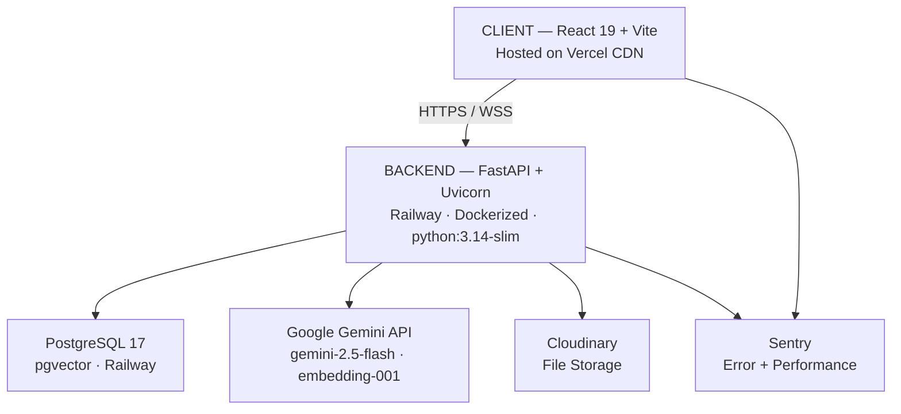
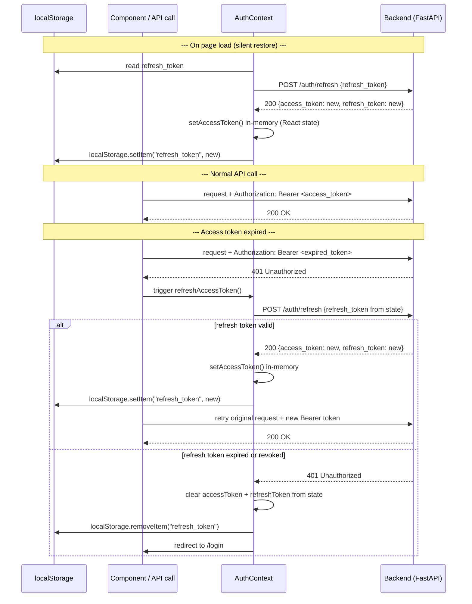
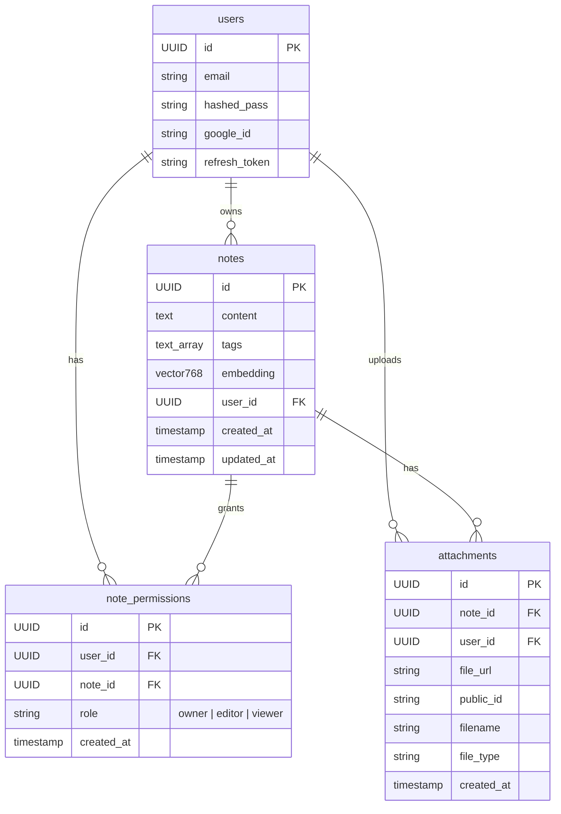
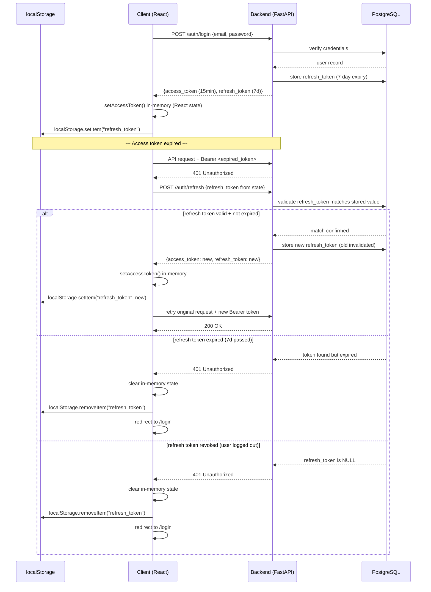
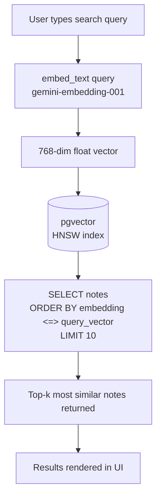
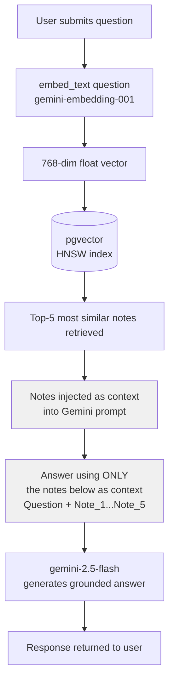

> **Status:** Production
> **Last updated:** April 2026
> **Author:** Soumya Acharya
> **Live system:** https://ai-notes-hub-omega.vercel.app/

# Architecture — AI Notes Hub

## Table of Contents

1. [System Overview](#1-system-overview)
2. [High-Level Architecture](#2-high-level-architecture)
3. [Frontend Architecture](#3-frontend-architecture)
4. [Backend Architecture](#4-backend-architecture)
5. [Database Design](#5-database-design)
6. [Authentication & Authorization](#6-authentication--authorization)
7. [AI Pipeline](#7-ai-pipeline)
8. [Real-Time Collaboration](#8-real-time-collaboration)
9. [File Storage](#9-file-storage)
10. [Security Design](#10-security-design)
11. [Deployment Architecture](#11-deployment-architecture)
12. [Monitoring & Observability](#12-monitoring--observability)
13. [Design Decisions & Trade-offs](#13-design-decisions--trade-offs)

---

## 1. System Overview

AI Notes Hub is a full-stack, AI-powered note-taking application. Users can create rich-text notes, collaborate in real time, search semantically, and query their notes using natural language via a RAG (Retrieval-Augmented Generation) pipeline.

**Core capabilities:**
- Rich-text CRUD with TipTap editor
- JWT + Google OAuth authentication with refresh token rotation
- Gemini-powered summarization, auto-tagging, semantic search, and RAG Q&A
- pgvector-backed vector similarity search (HNSW index)
- Real-time collaboration via WebSockets
- File attachments via Cloudinary
- Rate limiting, security headers, RBAC
- Sentry error tracking and performance monitoring

---

## 2. High-Level Architecture



**Request flow (happy path):**
1. Browser sends HTTPS request with `Authorization: Bearer <access_token>`
2. FastAPI validates JWT, resolves `user_id`
3. Route handler calls CRUD layer with async SQLAlchemy session
4. CRUD queries PostgreSQL; AI routes additionally call Gemini API
5. Response serialized via Pydantic v2 and returned as JSON
6. Sentry traces the full request lifecycle end-to-end

---

## 3. Frontend Architecture

### Stack
- **React 19** — UI library with concurrent rendering
- **Vite** — build tool with HMR and native ESM
- **React Router v7** — client-side routing with `<Routes>` and `<Navigate>`
- **Context API** — global auth state (no Redux needed at this scale)
- **TipTap** — headless rich text editor built on ProseMirror
- **Vanilla CSS** — no CSS framework; full control over design

### Folder Structure
```
src/
├── api/           # All HTTP calls (authApi.js, notesApi.js)
├── context/       # AuthContext — token storage, refresh logic
├── hooks/         # useNoteSocket — WebSocket lifecycle management
├── components/    # UI components (LoginForm, NoteForm, NoteList, etc.)
├── App.jsx        # Route definitions + top-level state
└── main.jsx       # React entry point + Sentry init + ErrorBoundary
```

### State Management Strategy
- **Auth state** lives in `AuthContext` — `accessToken`, `isAuthenticated`, `logout()`, `refreshAccessToken()`
- **Notes state** lives locally in `App.jsx` — lifted up and passed as props; no global store needed
- **Search state** lives in `App.jsx` — debounced with `setTimeout` (400ms) to avoid hammering the API
- **WebSocket state** lives in `useNoteSocket` hook — encapsulates connect, reconnect, and cleanup

### Token Refresh Strategy



Every API call in `notesApi.js` wraps with a refresh interceptor:
```
1. Make API call with current access token from memory
2. If 401 received → call POST /auth/refresh with refresh token in JSON body
3. Receive new access token + new refresh token in response
4. Update in-memory React state (AuthContext) with new access token
5. Retry original request once with new access token
6. If refresh also fails → logout user
```
This pattern avoids token expiry interrupting the user experience silently.

### Routing
```
/login          → LoginForm (redirects to / if already authenticated)
/register       → RegisterForm
/oauth-callback → OAuthCallback (handles Google redirect)
/               → NotesPage (ProtectedRoute — redirects to /login if not authenticated)
*               → redirect to /
```

---

## 4. Backend Architecture

### Stack
- **FastAPI** — async Python web framework with automatic OpenAPI docs at `/docs` (Swagger UI)
- **Uvicorn** — ASGI server running FastAPI
- **SQLAlchemy 2.0** — async ORM with `AsyncSession`
- **Pydantic v2** — request/response validation and serialization
- **Alembic** — database migration management
- **slowapi** — rate limiting middleware (wraps `limits` library)

### Layered Architecture
`HTTP Request → Middleware → Route Handlers → CRUD → Service Layer → Models + Database`

This separation means:
- Routes never touch the DB directly — they always go through CRUD
- Services are stateless and independently testable
- CRUD functions accept a `db: AsyncSession` injected by FastAPI's dependency system

### Startup Sequence (`main.py`)
```
1. load_dotenv()                  ← load env vars
2. sentry_sdk.init(...)           ← init Sentry before anything else
3. alembic upgrade head           ← apply any pending DB migrations
4. FastAPI app created
5. Middlewares registered         ← Security → Session → CORS
6. Routers included               ← auth, notes, attachments, ws, users
```

Alembic runs on every startup — this is safe because Alembic is idempotent (skips already-applied migrations).

### Error Handling Strategy
All API errors are surfaced as FastAPI `HTTPException` with a consistent JSON shape:
```json
{ "detail": "Note not found." }
```
- **404** — resource not found or permission denied (intentionally ambiguous to avoid enumeration)
- **400** — bad input (e.g. email already registered)
- **401** — invalid or expired JWT
- **422** — Pydantic validation failure (automatic, includes field-level error detail)
- **429** — rate limit exceeded (slowapi)

Unhandled exceptions propagate to Sentry via `FastApiIntegration` and return a 500 to the client.

### Testing Strategy

```
backend/app/tests/
├── conftest.py          ← shared fixtures: async test client, isolated DB session
├── unit/
│   ├── test_crud_notes.py    ← CRUD functions tested against real async DB session
│   └── test_ai_service.py   ← AI service tested with mocked google-genai client
└── integration/
    ├── test_auth_routes.py       ← register, login, refresh, Google OAuth flow
    ├── test_notes_routes.py      ← full CRUD + permission enforcement
    └── test_attachment_routes.py ← upload and delete via mocked Cloudinary
```

**Key testing patterns:**
- `pytest-asyncio` with `asyncio_mode = "auto"` — all tests are `async def` with zero boilerplate
- `httpx.AsyncClient` with FastAPI `app` as the ASGI transport — real HTTP dispatch without a running server
- External services (Gemini, Cloudinary) are patched with `unittest.mock.patch` — tests never hit real APIs
- `TEST_DATABASE_URL` env var points to a separate `ai_notes_hub_test` database — production data is never touched
- `SENTRY_DSN` is set to `""` in CI — Sentry is silently disabled so test noise never hits the dashboard

### Async Database Session
```python
# Every request gets a fresh AsyncSession via FastAPI dependency injection
async def get_db() -> AsyncGenerator[AsyncSession, None]:
    async with AsyncSessionLocal() as session:
        yield session
```
Sessions are scoped per-request and auto-closed after the response is sent.

---

## 5. Database Design

### Engine
- **PostgreSQL 17** with the **pgvector** extension
- pgvector adds the `vector` column type and HNSW/IVFFlat index support
- Hosted on Railway with a persistent volume

### Schema



### pgvector Index
```sql
CREATE INDEX ON notes USING hnsw (embedding vector_cosine_ops);
```
- **HNSW** (Hierarchical Navigable Small World) — approximate nearest neighbor index
- Chosen over IVFFlat because HNSW has better query performance at the cost of slightly higher build time
- `vector_cosine_ops` — cosine similarity is appropriate for text embeddings (direction matters, not magnitude)
- Embedding dimension: **768** (gemini-embedding-001 output size)

### Migration Strategy
- All schema changes go through **Alembic autogenerate**
- Never manually edit migration files after generating
- Migration files are committed to the repo and auto-applied on startup
- `alembic/env.py` swaps `asyncpg` → `psycopg2` driver for Alembic's synchronous migration runner

---

## 6. Authentication & Authorization

### JWT Strategy



**Why not httpOnly cookies for access tokens?**
Access tokens are stored in React state (in-memory). This protects against XSS since JavaScript can't steal what isn't in localStorage or cookies. The access token is lost on page refresh — silently restored on mount by reading the refresh token from localStorage and calling /auth/refresh automatically before the first render completes.

### Refresh Token Rotation
Every `/auth/refresh` call:
1. Validates the incoming refresh token against the DB
2. Issues a **new** access token + a **new** refresh token
3. Stores the new refresh token, invalidating the old one

This means stolen refresh tokens can only be used once before they're rotated out.

### Google OAuth 2.0 Flow

```mermaid
sequenceDiagram
    participant U as User (Browser)
    participant FE as Frontend (React)
    participant BE as Backend (FastAPI)
    participant G as Google OAuth

    U->>FE: Click "Continue with Google"
    FE->>BE: GET /auth/google/login
    BE-->>FE: 302 Redirect → Google consent URL
    FE->>G: Browser follows redirect
    G-->>U: Show consent screen
    U->>G: Grant permission
    G-->>BE: GET /auth/google/callback?code=...
    BE->>G: Exchange code for profile
    G-->>BE: { email, google_id, name }

    alt Email already exists
        BE->>BE: Link Google account to existing user
    else New email
        BE->>BE: Create new user record
    end

    BE->>BE: Issue access token (15min) + refresh token (7d)
    BE-->>FE: 302 Redirect → /oauth-callback&#35;access_token=...
    FE->>FE: OAuthCallback.jsx calls loginWithTokens()
    FE-->>U: Redirect to / (notes page)

```



```
1. User clicks "Continue with Google"
2. Frontend calls GET /auth/google/login
3. Backend redirects to Google consent screen (Authlib generates URL)
4. Google redirects back to GET /auth/google/callback
5. Backend exchanges code for Google profile
6. If email exists → link Google account, issue tokens
7. If email is new → create user, issue tokens
8. Backend redirects to /oauth-callback#access_token=...&refresh_token=...
9. OAuthCallback.jsx extracts tokens and calls loginWithTokens()

```
> **Why `#` (fragment) and not `?` (query string)?**  
> URL fragments are never sent to the server in HTTP requests and are not written to server access logs.  
> A query string would expose the access token in Railway/Vercel access logs. Using `#` keeps the  
> tokens entirely client-side — they exist only in the browser's memory after the redirect.

### Role-Based Access Control (RBAC)
Every note operation checks the `note_permissions` table:

| Role   | Read | Edit | Delete | Share/Revoke |
|--------|------|------|--------|--------------|
| owner  | ✅   | ✅   | ✅     | ✅           |
| editor | ✅   | ✅   | ❌     | ❌           |
| viewer | ✅   | ❌   | ❌     | ❌           |

The owner is automatically inserted into `note_permissions` with role `owner` on note creation.

---

## 7. AI Pipeline

### Overview
All AI features use **Google Gemini** via the `google-genai` Python SDK. Notes are stripped of HTML by BeautifulSoup4 before being sent — either to `gemini-2.5-flash` for generation tasks (summarize, tag) or to `gemini-embedding-001` for vector embedding.

### Summarization
- **Model:** `gemini-2.5-flash`
- **Input:** stripped plain text of note
- **Output:** 2–3 sentence summary
- **Rate limit:** 20/min per user

### Auto-Tagging
- **Model:** `gemini-2.5-flash`
- **Input:** stripped plain text
- **Output:** comma-separated tags → parsed → saved to `notes.tags`
- **Rate limit:** 20/min per user

### Semantic Embedding
- **Model:** `gemini-embedding-001`
- **Input:** stripped plain text
- **Output:** 768-dimensional float vector
- **Trigger:** auto-runs on every note create and update
- **Stored in:** `notes.embedding` (pgvector `vector(768)` column)

### Semantic Search

`<=>` is pgvector's cosine distance operator. Lower value = more similar.

### RAG Q&A Pipeline


RAG grounds the model's response in the user's actual notes, preventing hallucination and making answers personally relevant.

---

## 8. Real-Time Collaboration

### WebSocket Architecture
Two separate WebSocket channels:

| Channel | Endpoint | Purpose |
|---------|----------|---------|
| Note room | `/ws/notes/{note_id}?token=` | Per-note live editing, typing indicators, presence |
| User channel | `/ws/user?token=` | Per-user push notifications (e.g. note_shared) |

> **Why `?token=` (query param) instead of an `Authorization` header?**  
> The browser WebSocket API (`new WebSocket(url)`) does not allow setting custom headers — only the URL can be controlled at connect time. Passing the JWT as a query parameter is the standard pattern for WebSocket auth. The token is short-lived (15 min) and the endpoint validates it before accepting the connection, keeping the exposure window minimal.

### Connection Manager (`services/ws.py`)
```
ConnectionManager
└── _rooms: dict[room_key → dict[user_id, WebSocket]]
         ├── note rooms keyed by note_id         ← per-note editing
         └── user rooms keyed by "user:{user_id}" ← per-user notifications

Methods:
├── connect(note_id, user_id, ws)
├── disconnect(note_id, user_id)
├── broadcast(note_id, payload, exclude_user=None)
├── presence(note_id) → list[user_id]
└── close_room(note_id)
```

### Message Protocol
All messages are JSON with a `type` field:

```json
// Client → Server
{ "type": "note_update", "content": "<p>...</p>", "tags": ["ai"] }
{ "type": "typing",      "user_email": "user@example.com" }

// Server → Client  
{ "type": "note_update", "content": "<p>...</p>", "tags": ["ai"], "user_email": "..." }
{ "type": "typing",      "user_email": "user@example.com" }
{ "type": "presence",    "event": "joined",  "user_email": "..." }
{ "type": "presence",    "event": "left",   "user_email": "..." }
{ "type": "note_shared", "note_id": "...", "role": "editor" }
```

### Reconnect Strategy
The frontend (`useNoteSocket.js`) uses true exponential backoff:
```
WebSocket closes unexpectedly
     ↓
Wait BACKOFF[attempt] → [1s, 2s, 4s, 8s] (capped at 8s)
     ↓
Reconnect (if component still mounted), attempt++
```
An `alive` ref guards against reconnecting after the component unmounts. On successful reconnect `attempt` resets to 0 and any queued sends are flushed.

### 60-Second Fallback Poll
In addition to WebSockets, `App.jsx` polls `GET /notes/` every 60 seconds as a safety net — catches any updates that the WebSocket may have missed (e.g. during a brief disconnect).

---

## 9. File Storage

### Strategy
Files are **never stored on the backend server**. The backend acts as a signing proxy:

```
Client selects file
     ↓
POST /attachments/notes/{note_id}  (multipart/form-data)
     ↓
Backend reads file bytes
     ↓
Calls cloudinary.uploader.upload() server-side using API secret
     ↓
Cloudinary returns { secure_url, public_id }
     ↓
Backend saves { file_url, public_id, filename, file_type } to DB
     ↓
Returns attachment metadata to client
```

**File validation (enforced before upload):**
- **Max size:** 10 MB — rejected with HTTP 413 if exceeded
- **Allowed types:** `image/jpeg`, `image/png`, `image/gif`, `image/webp`, `application/pdf`, `text/plain`, `video/mp4`, `video/quicktime` — rejected with HTTP 415 if not in the allowlist

Validation runs on the raw bytes before any call to Cloudinary, so rejected files never consume API quota.

**Why server-side uploads?**
If the client uploaded directly to Cloudinary, the `API_SECRET` would need to be exposed in the browser — a critical security risk. Server-side signing keeps the secret in the backend environment only.

### Deletion
```
DELETE /attachments/{attachment_id}
     ↓
Backend fetches attachment (verifies ownership)
     ↓
Calls cloudinary.uploader.destroy(public_id)
     ↓
Deletes DB record
```

Cloudinary's `public_id` is stored in the DB specifically to enable server-side deletion.

---

## 10. Security Design

### Layers of Defense

```
Internet
   ↓
Vercel / Railway (TLS termination — HTTPS/WSS enforced)
   ↓
SecurityHeadersMiddleware
   ├── Strict-Transport-Security (HSTS) — max-age=31536000, force HTTPS for 1 year
   ├── X-Content-Type-Options: nosniff — prevent MIME sniffing
   ├── X-Frame-Options: DENY — prevent clickjacking
   ├── Referrer-Policy: strict-origin-when-cross-origin
   ├── Permissions-Policy — disable camera, mic, geolocation
   └── X-XSS-Protection: 1; mode=block
   ↓
CORS middleware — only FRONTEND_URL origin allowed
   ↓
JWT validation on every protected route
   ↓
RBAC check in every CRUD operation
   ↓
Rate limiting (slowapi) — per-endpoint token buckets
   ↓
PostgreSQL — parameterized queries via SQLAlchemy (no SQL injection)
```
> **Note on Content Security Policy (CSP):** A strict CSP header is deliberately not set in the backend middleware because Vercel injects CDN-level CSP headers for the frontend. The FastAPI backend serves only API JSON responses, so CSP is not applicable there. For a future SSR deployment, a backend-set CSP would be added.

### Rate Limiting Table

| Endpoint group   | Limit   | Reason                              |
|------------------|---------|-------------------------------------|
| /auth/register   | 5/min   | Prevent account enumeration         |
| /auth/login      | 10/min  | Brute-force protection              |
| /auth/refresh    | 20/min  | Prevent token farming               |
| AI endpoints     | 20/min  | Gemini API cost protection          |
| Semantic search  | 30/min  | Embedding API cost protection       |
| Note writes      | 60/min  | General abuse prevention            |

---

## 11. Deployment Architecture

### Infrastructure

```
Developer machine
      │
      │  git push origin main
      ▼
GitHub (source of truth)
      │
      ├──▶ GitHub Actions CI
      │         └── spins up postgres service container
      │         └── runs: pytest app/tests/ -v
      │         └── ❌ does NOT block Railway/Vercel deploys
      │
      ├──▶ Railway (backend)
      │         └── auto-deploys on push to main (independent of CI)
      │         └── reads railway.json → builder: DOCKERFILE
      │         └── builds backend/Dockerfile
      │         └── runs: uvicorn main:app --host 0.0.0.0 --port 8000
      │         └── alembic upgrade head runs on startup
      │
      └──▶ Vercel (frontend)
                └── detects push to main
                └── reads vercel.json
                └── runs: npm run build (Vite)
                └── deploys static assets to CDN edge
```

### Docker Setup (Local Dev)
```yaml
services:
  db:
    image: pgvector/pgvector:pg17
    volumes:
      - pgdata:/var/lib/postgresql/data

  backend:
    build: ./backend
    depends_on:
      db:
        condition: service_healthy
    env_file: ./backend/.env
    environment:
      DATABASE_URL: postgresql+asyncpg://postgres:postgres@db:5432/ai_notes_hub
```

The `db` service uses a named volume so data persists across `docker compose down` / `up` cycles.

### Environment Variables

| Variable | Where set | Used by |
|----------|-----------|---------|
| DATABASE_URL | Railway / local .env | SQLAlchemy + Alembic |
| SECRET_KEY | Railway / local .env | JWT signing |
| GOOGLE_CLIENT_ID/SECRET | Railway / local .env | OAuth |
| GEMINI_API_KEY | Railway / local .env | AI service |
| CLOUDINARY_* | Railway / local .env | File uploads |
| SENTRY_DSN | Railway / local .env | Backend Sentry |
| APP_ENV | Railway / local .env | Sentry environment tag |
| VITE_API_BASE_URL | Vercel / .env.example | Frontend API calls |
| VITE_WS_BASE_URL | Vercel / .env.example | Frontend WebSocket |
| VITE_SENTRY_DSN | Vercel / .env.example | Frontend Sentry |

---

## 12. Monitoring & Observability

### Sentry Backend (`sentry-sdk[fastapi]`)
- **FastApiIntegration** — automatically captures unhandled exceptions per request, records HTTP method, URL, status code
- **SqlalchemyIntegration** — traces slow DB queries, captures query errors
- **traces_sample_rate: 1.0** — 100% of transactions traced on the backend
- **send_default_pii: False** — GDPR-safe; no user emails or IPs sent to Sentry by default
- **APP_ENV** tag — separates `development` vs `production` issues in Sentry dashboard

### Sentry Frontend (`@sentry/react`)
- **browserTracingIntegration** — captures page load performance, navigation timing, and API call durations
- **replayIntegration** — records session replays on errors (text masked, media blocked for privacy)
- **tracesSampleRate: 0.1** — 10% of frontend transactions traced (reduced to limit overhead)
- **replaysSessionSampleRate: 0.1** — 10% of normal sessions recorded
- **replaysOnErrorSampleRate: 1.0** — always capture a replay when an error occurs
- **ErrorBoundary** — wraps entire app; catches React render errors, reports to Sentry, shows fallback UI

### What Gets Tracked
| Event | Backend | Frontend |
|-------|---------|----------|
| Unhandled exceptions | ✅ | ✅ |
| API request traces | ✅ | ✅ (as spans) |
| Slow DB queries | ✅ | — |
| React render errors | — | ✅ (ErrorBoundary) |
| Session replays on error | — | ✅ |
| Page load performance | — | ✅ |

### CI Behavior
`SENTRY_DSN` is set to an empty string in GitHub Actions — this disables Sentry silently during tests so test noise never pollutes the Sentry dashboard.

---

## 13. Design Decisions & Trade-offs

### Why FastAPI over Django/Flask?
FastAPI's native `async/await` support maps directly to async DB drivers (`asyncpg`) and async AI API calls. Django's ORM is synchronous by default, and Flask requires third-party async extensions. FastAPI also generates OpenAPI docs automatically — essential for API development speed.

### Why PostgreSQL + pgvector over a dedicated vector DB (Pinecone, Weaviate)?
Keeping vectors in the same Postgres instance eliminates a network hop and a separate service to maintain. At this scale (thousands of notes per user), pgvector with HNSW index is more than sufficient. The trade-off is that at millions of records, a dedicated vector DB would outperform pgvector.

### Why SQLAlchemy async over raw asyncpg?
SQLAlchemy provides the ORM layer (model definitions, relationships, migrations via Alembic) while still using asyncpg as the underlying driver. Raw asyncpg would require writing SQL strings manually and building a migration system from scratch.

### Why in-memory rate limiting (slowapi) over Redis-backed?
For a single-instance deployment (Railway runs one container), in-memory rate limiting is sufficient and has zero infrastructure overhead. The trade-off: if the app scales to multiple instances, counters would be per-instance rather than global — at that point, migrating to a Redis-backed limiter would be necessary.

### Why Cloudinary over S3?
Cloudinary provides a free tier, built-in image transformation, and a simple Python SDK — ideal for a portfolio project. S3 would be the production choice at scale due to lower cost per GB and tighter AWS ecosystem integration.

### Why access tokens in memory (not localStorage)?
localStorage is accessible to any JavaScript on the page — a successful XSS attack would immediately steal all tokens. In-memory storage (React state) means tokens are lost on refresh but are invisible to injected scripts. The refresh token handles seamless re-authentication.

### Why Alembic auto-migrate on startup?
Railway doesn't support running pre-deploy scripts natively without a custom entrypoint. Running `alembic upgrade head` in `main.py` at startup guarantees the schema is always up-to-date before the first request is served. The operation is idempotent — it's a no-op if all migrations are already applied.

### Horizontal Scaling Trade-offs
The current single-instance deployment has two components that would need to change before the backend can scale horizontally:

| Component | Current | At scale |
|-----------|---------|----------|
| WebSocket `ConnectionManager` | In-process Python dict — rooms are not shared across instances | Replace with Redis Pub/Sub so any instance can broadcast to any room |
| slowapi rate limiter | In-memory per-instance counters | Replace with Redis-backed storage so limits are enforced globally |

For a single Railway container (the current deployment), both in-memory approaches are correct and have zero infrastructure overhead. These are intentional trade-offs documented here so the path to scaling is clear.
